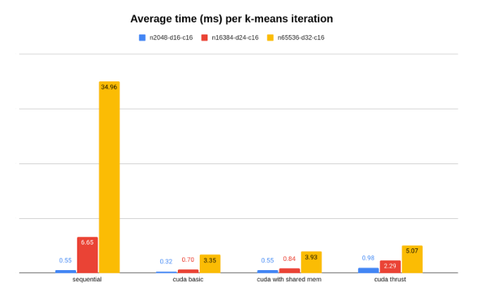

# 1. TLDR

We examine the theoretical and empirical boost in speed, when we move from sequential implementation of K-means on the CPU to parallel implementations on the GPU. Theoretically, we can expect a speed up of over 1000x. Empirically, we observe a ~10x speed up. When studying this divergence between expectation and reality, we account for factors: namely data transfer and synchronisation “costs”. We conclude with remarks on the use of higher-level frameworks like Thrust and possible speed ups from using libraries like GEMM.

# 2. CUDA Implementation of Parallel K-means
## 2.1 Environment
## 2.2 Approach

# 3. Speedup: Expectation vs Reality
## 3.1 Theoretical Estimate
## 3.2 Empirical Results

    

## 3.3 Analysis: Why Reality was Different from Expectation

# 4. Parting Remarks