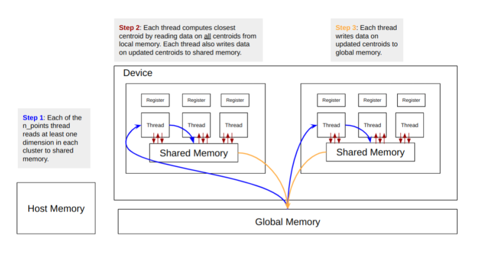
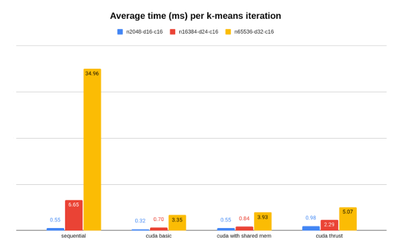
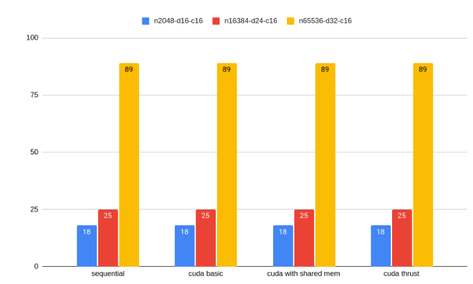

# 1. TLDR

We examine the theoretical and empirical boost in speed, when we move from sequential implementation of K-means on the CPU to parallel implementations on the GPU. Theoretically, we can expect a speed up of over 1000x. Empirically, we observe a ~10x speed up. When studying this divergence between expectation and reality, we account for factors: namely data transfer and synchronisation “costs”. We conclude with remarks on the use of higher-level frameworks like Thrust and possible speed ups from using libraries like GEMM.

# 2. CUDA Implementation of Parallel K-means
## 2.1 Environment
Our experiment takes place on a single machine running NVIDA Tesla T4.
## 2.2 Approach
K-means comprises two key steps:
- <u>Stage 1</u>: Compute closest centroid for each point; and
- <u>Stage 2</u>: Update centroids.

In the rest of this report, we use “n_” to denote the following.
- n_points: Number of points in dataset, e.g. 2048, 16384, 65536.
- n_dims: Number of dimensions of points, e.g. 16, 24, 32.
- n_clusters: Number of K-means clusters, e.g. 16.

Our sequential implementation adopts an optimisation trick. We use information gleaned from Stage 1 to speed up Stage 2. We obtain such information at Stage 1 by (a) accumulating the sum of coordinates for each new centroid, and (b) counting points assigned to each new centroid. With such information already gleaned from Stage 1, Stage 2 becomes a more trivial step. At Stage 2, we just average out the summed coordinates of new points in each centroid.

Our parallel implementations are:
- CUDA Basic;
- CUDA with shared memory (“CUDA SharedMem”); and
- CUDA Thrust.

Both CUDA Basic and CUDA SharedMem adopt the same algorithm.
- <u>Stage 1</u>: We launch **n_points** number of threads, and each thread computes the distance to every centroid, and assigns the point to one of the centroids. Each thread also updates the accumulated sum and count of threads, which is used in Stage 2.
- <u>Stage 2</u>: We launch **n_clusters** * **n_dims** number of threads. Each thread divides the accumulated sum of the points newly assigned to a centroids, with the count of the number of points assigned to the new centroids.

CUDA Basic and CUDA SharedMem differ in their memory management approach. <u>Fig 1</u> illustrates how CUDA SharedMem attempts to cut latency by shifting centroid data from the GPU’s general memory to shared memory, although it incurs an overhead of loading centroid data into shared memory for each iteration.

<b>fig 1: shared memory for computing closest centroid</b>

    

We do not perform the optimisation in Fig 1 for Stage 2, since each thread (where there are **n_clusters** * **n_dims** number of threads) just reads once from general memory. Hence the overhead of loading data into shared memory will not be worth it.

# 3. Speedup: Expectation vs Reality
## 3.1 Theoretical Estimate
## 3.2 Empirical Results

<b>fig 2: timing of seq vs parallel implementation</b>

    

<b>fig 3: iterations to convergence at threshold of 10^-6</b>

    

## 3.3 Analysis: Why Reality was Different from Expectation

# 4. Parting Remarks